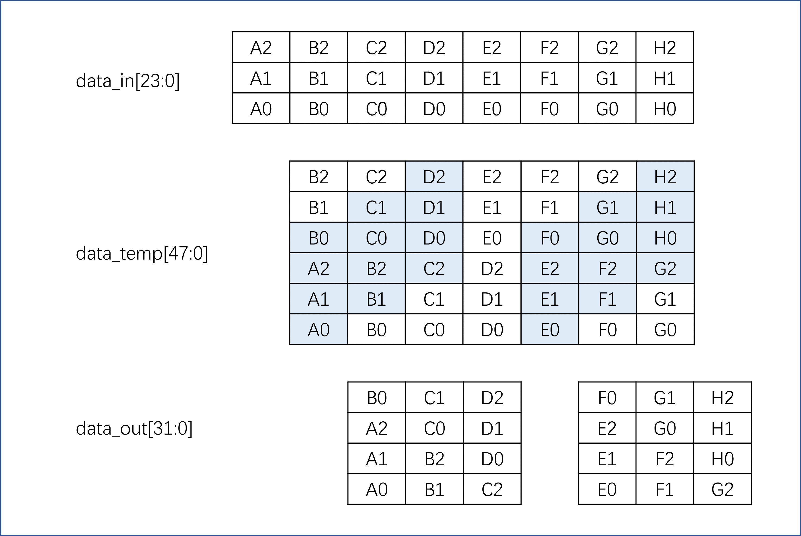

# GearBox_24_32 使用说明

## 前言

GearBox变速箱，这里指的是RTL里非整数的位宽转换模块。本模块将24bit的信号（带使能）转换到32bit（带使能）。因为是低位宽转高位宽，可以在同一个时钟域下完成转换，只不过输入与输出的使能占比不同。如果想要输出也是连续的流，可以在后面加一个异步fifo或RAM整流。

## 数据传输结构

数据的输入输出关系如下图所示。

## 输入连续时序图

随着数据输入的信号有data_en和data_in_last。data_en代表当前clock数据有效，data_in_last为行结束信号，代表一行的数据传输结束，并且会重置内部计数器，内部计数器的作用为判断当前data_in为输入的哪一个相位。

正常来讲，每4个输入就会有3个输出，当然data_in_last允许出现在数据比例异常的情况。也就是说最后一组数据只有1/2/3个输入，输出会有1/1/2个。具体的输入输出关系可以参考下面的时序图。

下图为data_in_last出现在第1相位：

下图为data_in_last出现在第2相位：

下图为data_in_last出现在第3相位：

## 输入断续的时序图

当然，更进一步的是本模块可以支持输入使能断续的转换。

下图为输入断续下data_in_last出现在第0相位：

下图为输入断续下data_in_last出现在第1相位：

下图为输入断续下data_in_last出现在第2相位：

下图为输入断续下data_in_last出现在第3相位：

