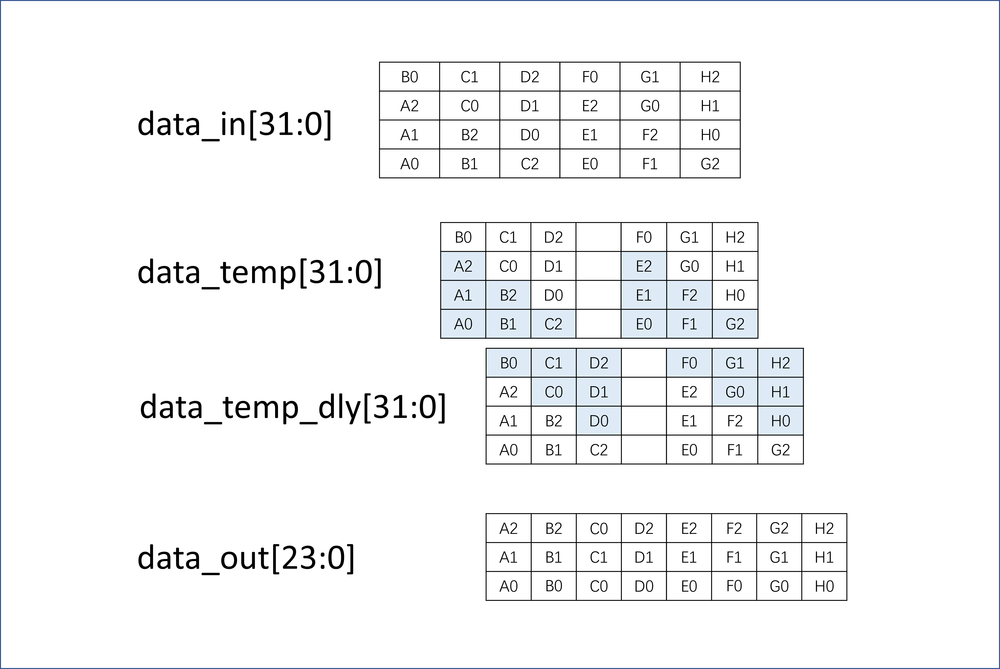
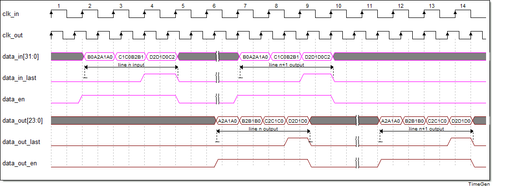
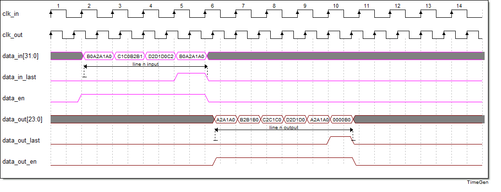
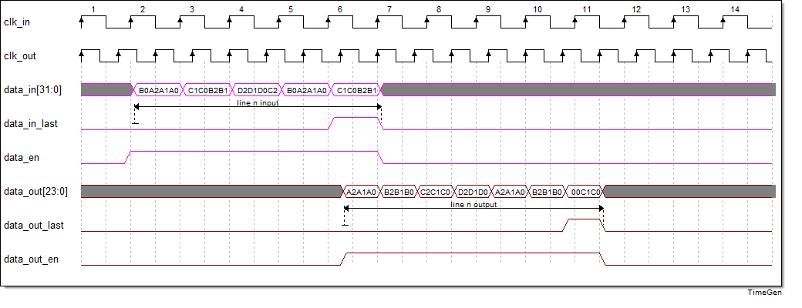
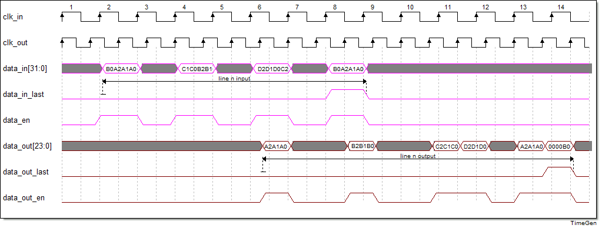

# GearBox_32_24 使用说明

## 前言

GearBox变速箱，这里指的是RTL里非整数的位宽转换模块。本模块将32bit的信号（带使能）转换到24bit（带使能）。因为是高位宽转低位宽，必须要加快时钟域才能完成转换，理论输入输出时钟比例为3：4。一般来讲输出多高一些保证正常运行，如果想要输出也是连续的流，可以在后面加一个异步fifo或RAM整流。

## 数据传输结构

数据的输入输出关系如下图所示，和GearBox_24_32不一样的地方在于本模块需要先加快时钟，再进行pipeline转换。数据的输入输出延迟也相对高上不少。

## 输入连续时序图

随着数据输入的信号有data_en和data_in_last。data_en代表当前clock数据有效，data_in_last为行结束信号，代表一行的数据传输结束，并且会重置内部计数器，内部计数器的作用为判断当前data_in为输入的哪一个相位。输入和输出延迟大约8-9个输入时钟，主要为时钟转换fifo的延迟，示意图没有画那么久。

正常来讲，每3个输入就会有4个输出，当然data_in_last允许出现在数据比例异常的情况。也就是说最后一组数据只有1/2个输入，输出会有2/3个。具体的输入输出关系可以参考下面的时序图。示意图输入时钟与输出时钟恰好是3：4，所以输出没有断续，当输出时钟更快的时候会出现data_out_en断续的情况。

下图为data_in_last出现在第1相位：

下图为data_in_last出现在第2相位：

## 输入断续的时序图

当然，更进一步的是本模块可以支持输入使能断续的转换。

下图为输入断续下data_in_last出现在第1相位：

