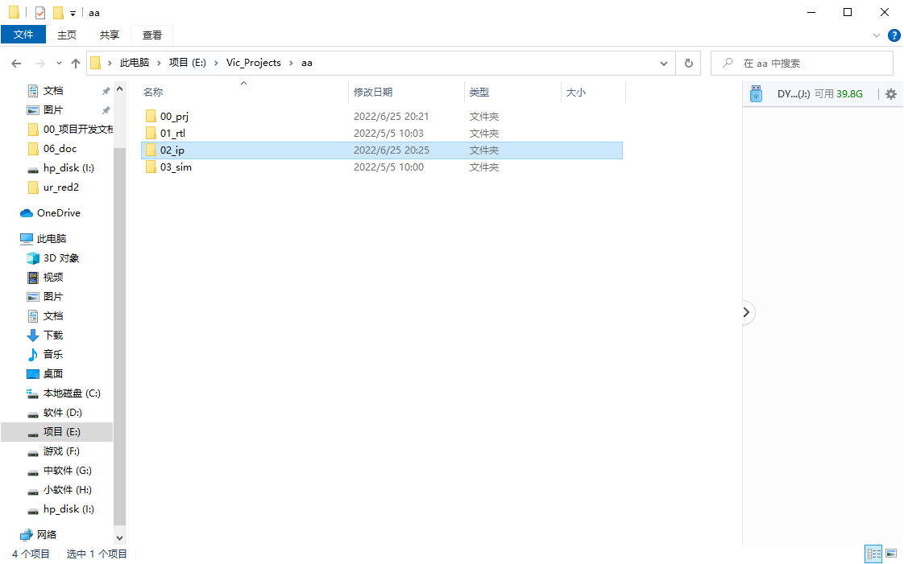
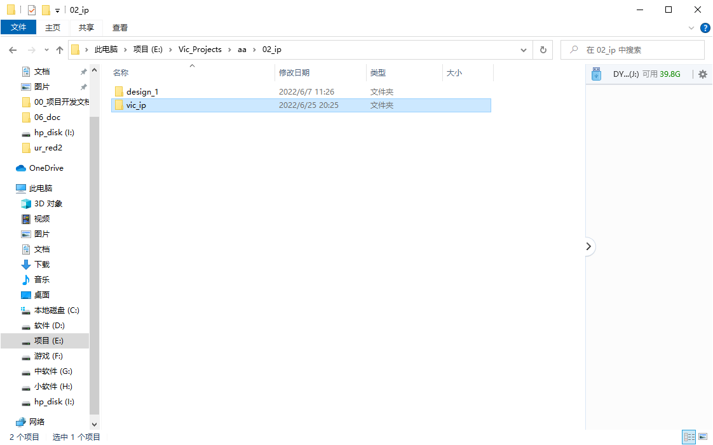
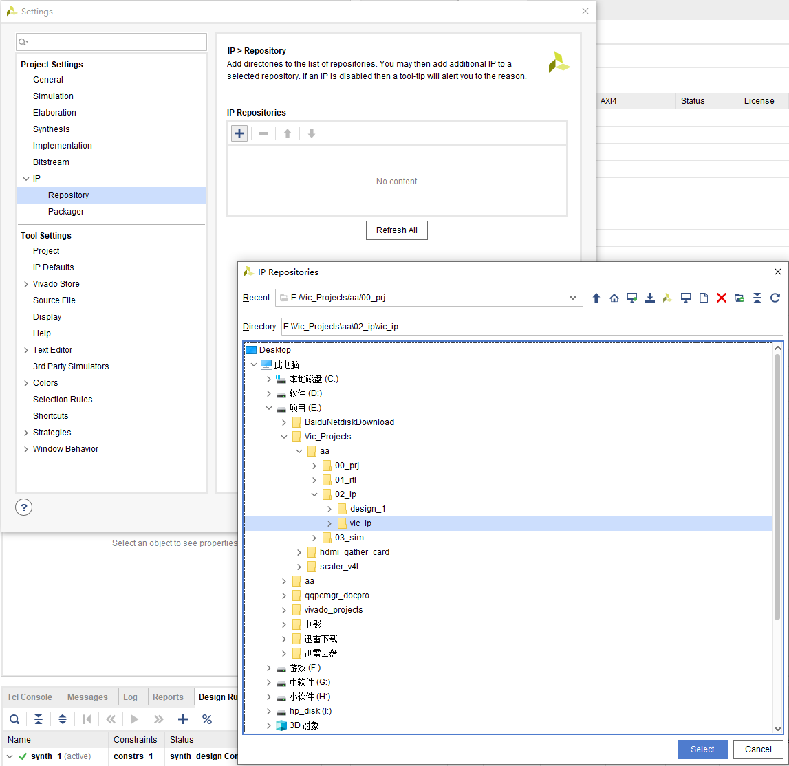
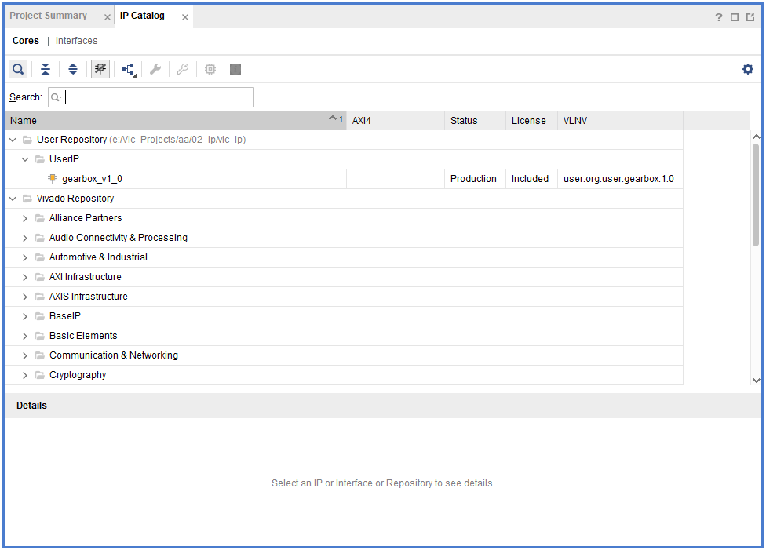

# vic_ip

vic_ip为本人免费开放的ip库，可以添加到vivado使用（编写版本为2021.2），也可以提取verilog源代码作为参考，加入读者的设计中。

## vivado添加方法

下载vic_ip过后解压到您的工作目录，本人的工程文件目录如下

02_ip目录下存放调用的IP

打开自己的工程过后，在settings里面找到IP选项，点击加号添加ip路径。

添加完成过后，就可以在IP Catalog里面找到添加的ip, 然后和Xilinx官方ip一样使用即可。

