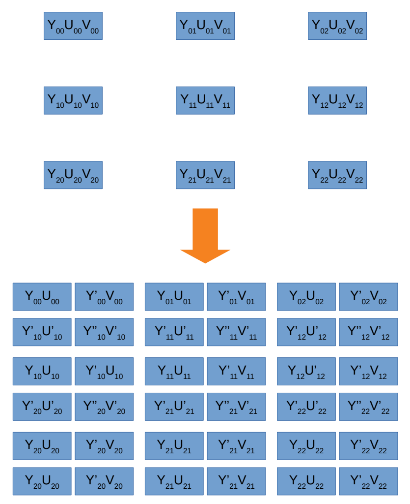
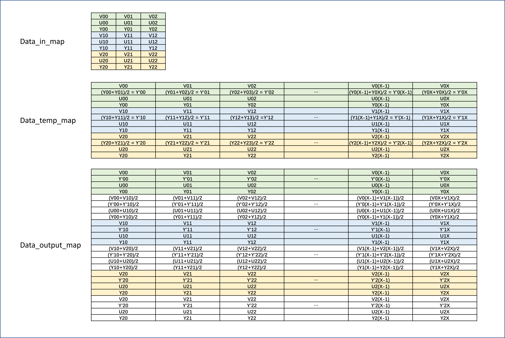

# YUV_2xy_scaler 使用说明

## 前言

YUV_2xy_scaler模块用于将YUV4:4:4的axis视频流数据，分辨率放大到2倍，并且将视频格式转换为YUV4:2:2。举个例子，1920x1080@60放大为3840x2160@60。本模块没有使用参数化编程，只有当需求很旺盛的时候，才能体现参数化编程的优势，不然只会徒增烦恼。

## 数据mapping

每一帧的数据放大原理如下图所示，利用YUV的特性，UV数据可以像素间共用，完成这种异构的双线性插值。

下图所示为模块内部数据mapping关系，模块内部主要分为两次放大。

第一次放大将YUV4:4:4转化为YUV4:2:2，即可实现每一行像素个数从1920到3840的转换，新的像素在偶数位，第3840个像素采用第3839像素的值。

第二次放大实现像素行插值，帧行数从1080插值到2160，利用3个BRAM实现，新的像素在偶数位，第2160行采用第2159行的数据。

## IP 配置

本模块相对复杂，如果参数化编程会相当的麻烦，所以我按照实际使用情况，将部分参数固定，读者如若有特殊需求，可以自行修改代码。在固定参数过后模块好用多了，只需要配置分辨率信息即可。

## 输入输出时序图

整个模块是以pipeline形式进行缩放，输出相对输入延迟1.5行的时间（输入的行计数），结构精巧，资源节省，画质不俗（容我得意一下）。

下图主要展示行插值的时序关系。输入行依次进入bram0/bram1/bram2，做三元乒乓，同时pix per clock扩张到4，这样就恰好可以完成FHD(1920x1080)到UHD(3840x2160)的放大。

