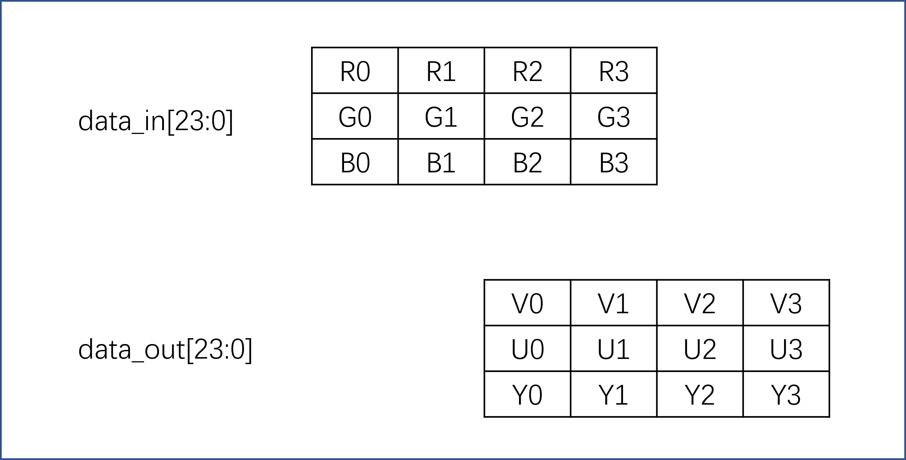
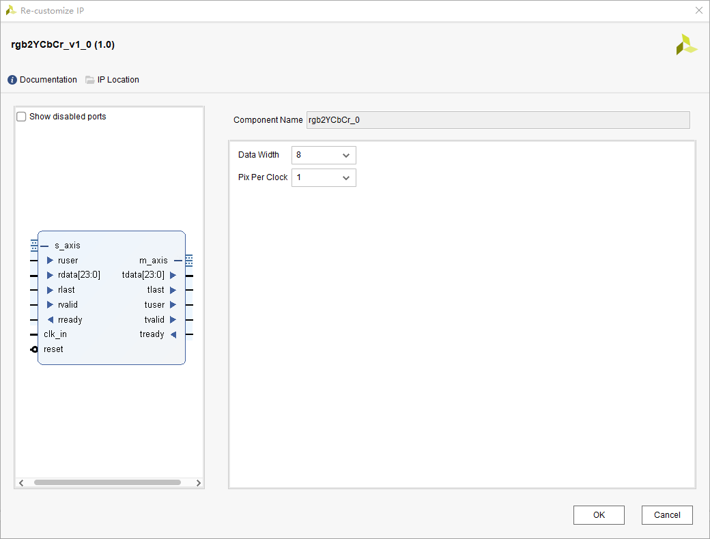
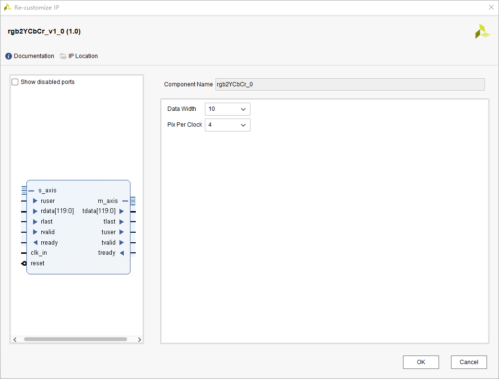
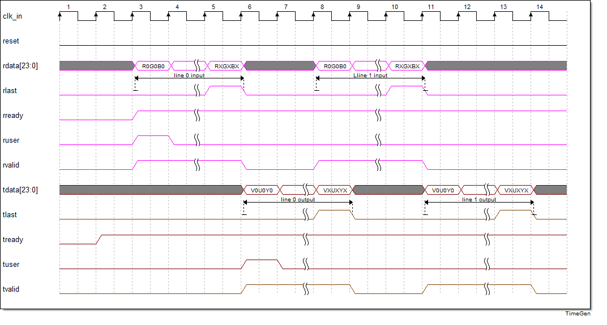

# rgb2YCbCr 使用说明

## 前言

rgb2YCbCr模块用于将RGB色彩坐标系的axis视频流转换到YUV4:4:4色彩坐标系。同时钟像素个数和输入位宽可以参数化设置。本人只测试了pix_per_clock = 1, data_width = 8情况下的输出，其他情况暂时没有测试，本来开发来就是这个条件下使用的，一时兴起想写写参数化配置代码。

## 数据传输结构

数据的输入输出关系如下图所示。请注意输入数据的RGB顺序，R在最高位，这与Xilinx的官方axis定义不同，主要是因为本模块的前级输入为ADV7611，其RGB输出格式如此。

## 数据转换公式

RGB和YUV之间是可以pix by pix的转换的，计算公式如下，也许您在其他地方会看到系数略微差异的公式，这是因为不同的色彩空间版本导致的，其坐标轴略有偏差。

 Y  = 0.183 * R + 0.614 * G + 0.062 * B + 16;

Cb = -0.101 * R - 0.338 * G + 0.439 * B + 128;

Cr = 0.439 * R - 0.399 * G - 0.040 * B + 128;

## IP 配置

模块的配置很简单，Data Width代表RGB中每种颜色的位宽，Pix Per Clock代表每个时钟传输几个像素。

IP只提供了常用的配置，如果有非常规的需求，可以更改源码实现。

## 输入输出时序图

本模块相对简单，输入输出都是axis接口，输入rdata[23:0]具体为{R[7:0],G[7:0],B[7:0]}，输出数据tdata[23:0]则使用官方定义的axis中相应的YUV顺序{V[7:0],U[7:0],Y[7:0]}。输入和输出之间有4个clock的延迟。

